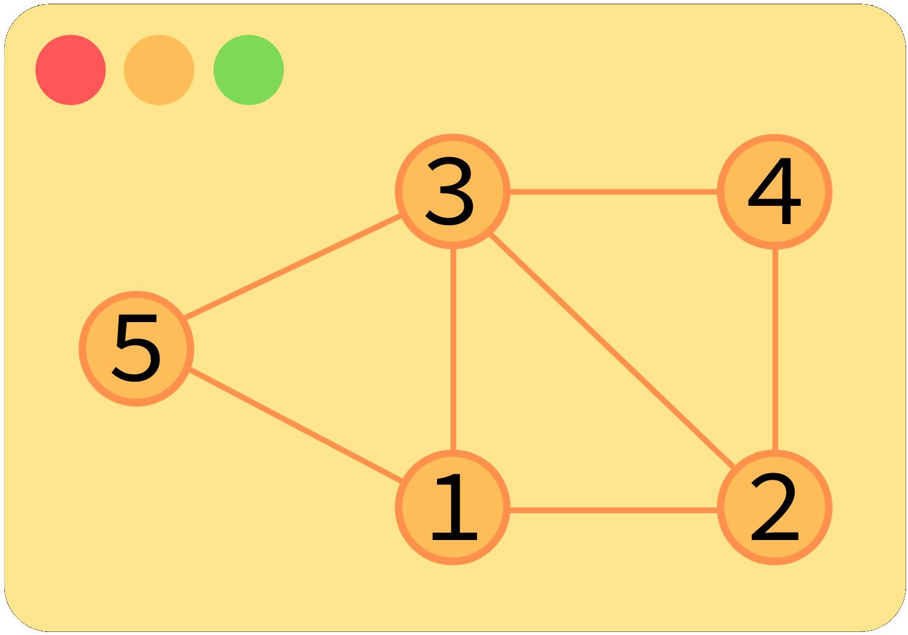
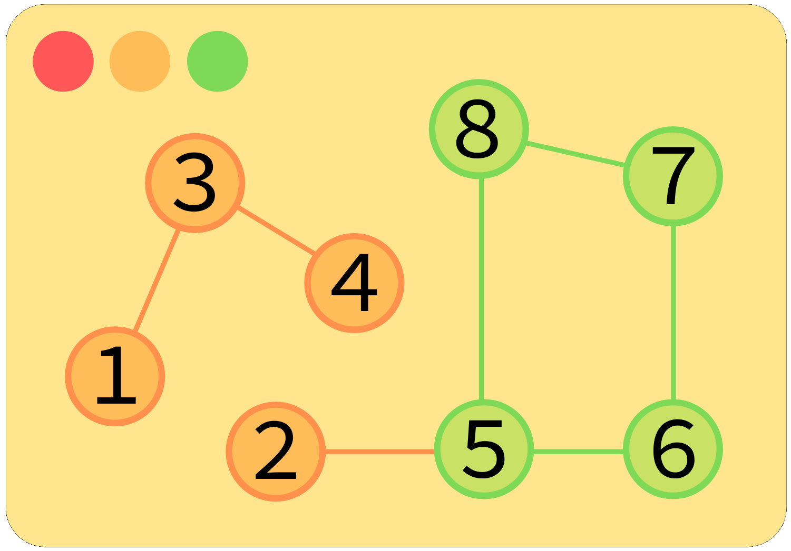
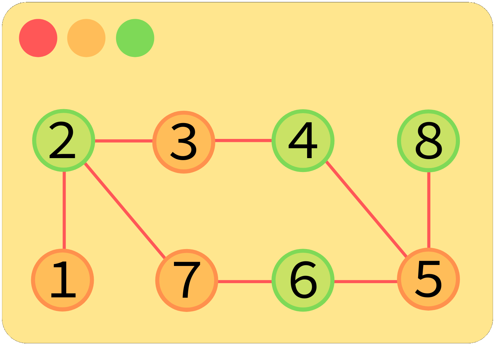
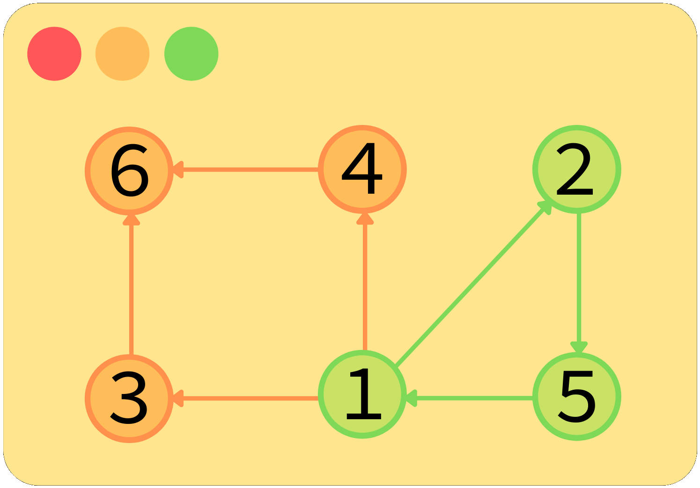

 
    <code>Graph Representation</code>  
    

 
    <code>Graph Traversals : BFS and DFS</code>  
    

 
    <code>Cycle Detection in Undirected Graph</code>  
    

 
    <code>Graph Coloring : Bipartite Graph</code>  
    

 
    <code>Cycle Detection in Directed Graph</code>  
    

